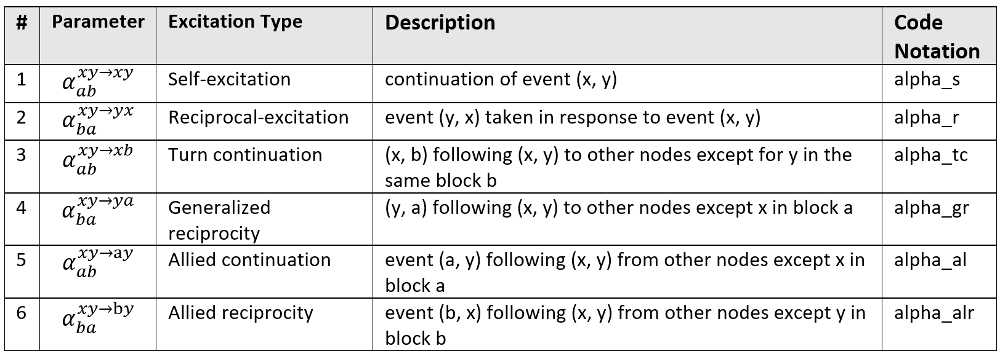

# MULCH: The Multivariate Community Hawkes Model

MULCH is a highly flexible continuous-time network model that introduces dependence between
node pairs in a controlled manner. This repo includes the model's implementation and code to
replicate all experiments
in [The Multivariate Community Hawkes Model for Dependent Relational Events in Continuous-time Networks](https://arxiv.org/abs/2205.00639 "The Multivariate Community Hawkes")
paper, presented at **International Conference on Machine Learning (ICML 2022)**.


### Description

Dynamic networks are in format of timestamped events between nodes pairs (x, y, t<sup>xy</sup>). We
jointly model all node pairs using a multivariate Hawkes process where an event between a node
pair (x, y) can increase the probability of events between same and other node pairs (i, j).

MULCH is based on the *Stochastic Block Model* where each node *i* belongs to a block *a*. Each
node pair *(i, j)*
then belongs to a block pair *(a, b)*. We assume a block diagonal structure on so that events of
node pair *(x, y)*
in *bp(a, b)* can only excite node pairs *(i, j)* in *bp(a, b)* & *bp(b, a)*.


### Excitation Parameters

Each block pair *(a, b)* has a unique set of excitation parameters,
called *alpha<sub>ab</sub><sup>xy->ij</sup>*, which controls how events between
node pairs *(i, j)* in the block pair *(a, b)* are excited by other node pairs.
We consider 6 types of excitations for each block pair, which are listed in the table below:



### Toy Example

Toy network of 8 nodes to illustrate the different excitations in MULCH. Nodes 1:5 are in block 
*a*, while nodes 6:8 are in block *b*. The event between *(1, 8)* (dashed line) excites the processes
of the other node pairs shown in solid lines by the specified excitation value *ab* or *ba*.


For more details about the model's assumptions and estimation procedure, please refer to our
paper [MULCH](https://arxiv.org/abs/2205.00639 "The Multivariate Community Hawkes").


--------------------------------------------------------------------

## Project Content

- `mulch_simulation_tests.py` runs the following MULCH Simulated Network Experiments (see
  subsection 5.1 & appendix B.2 in [our paper](https://arxiv.org/abs/2205.00639)\):
    1. spectral clustering accuracy
    2. refinement algorithm performance
    3. MULCH parameters estimation accuracy

- `mulch_MID_test.py` fits MULCH on MID dataset, then runs some evaluation performance
  experiments (subsection 5.2 & Section 6). A code snippet from this file is discussed in the *Usage
  Instructions* section below.

- `mulch_datasets_experiments.py` Fit MULCH on Reality Mining, Enron, Facebook datasets, and
  similarly evaluates performance (section 5.2).

- `chip_bhm_tests.py` & `adm4_tests.py` : CHIP, BHM, and ADM4 models comparison against MULCH (
  section 5.2).

- `storage` directory where all datasets files are saved.

--------------------------------------------------------------------

## Installation

To clone, use `git clone --recurse-submodules ` + repo URL

which will automatically initialize and update CHIP as a submodule in `CHIP-Network-Model` directory.

Alternatively, run the following commands from MULCH directory after cloning:
```
git submodule init
git submodule update
```

#### Submodules
- CHIP model's code is added as a submodule in the directory `CHIP-Network-Model`.

#### Dependancies
- `DyNetworkX` package, used for motif count experiments. To install, use:
`pip install DyNetworkX`
- Modified `hawkes` repository by Steve Morse for MULCH simulation (included as a directory).

#### Requirements
Refer to [requirements.txt](requirements.txt) for the required packages.

Note: We also used `tick==0.6.0` package for ADM4 model fitting tests.

--------------------------------------------------------------------

## Usage Instructions

### Fitting MULCH

- #### Argument of fit function:
  We fit MULCH using `fit_refinement_mulch()`. The following parameters need to be specified
  alongside passing train dataset:
    - `K`: number of network's blocks. We usually test the model over a range of values ex.`[1:10]`.
    - `n_alpha`: number of types of excitations per block pair (refer
      to [excitation table](storage/images/excitation_table.png) above). Can be set to `2` (self &
      reciprocal), `4` (first 4 types), or `6`. Default is `6`, which is our full model.
    - `betas`: (Q,) array of kernel decays. Choice of decay values depend on the network
      duration, events intensity, and timestamps scale. We recommend choosing up to 3 values. Timestamps
      in our datasets were rescaled to be in the range [0; 1000]. See the following `betas`
      suggestions for MID and Reality Mining datasets:
        - MID (duration=8380
          days) `betas = np.reciprocal(np.array([2*30, 2*7, 1/2]) * (1000 / 8380))  # [2months, 2weeks, 1/2day]`
        - Reality Mining (duration=150
          days) `betas = np.reciprocal(np.array([7, 2, 1/24]) * (1000 / 150) ) # [1week, 2day, 1hours]`
    - `max_iter_ref`: Maximum number of nodes membership refinement & fit iterations. Default
      is `0` (no refinement). Any integer between [0:10] is a reasonable range.
- #### Interpreting MULCH fit parameters:
  Our full model's parameters is a tuple `(mu_bp, alpha_1_bp, ..., alpha_n_bp, C_bp, betas)`, where:
    - `mu_bp` is the baseline (K, K) array for the K<sup>2</sup> block pairs. For
      example `mu_bp[a, b]` is the baseline parameter of node pairs in block pair *(a, b)*.
    - all `alpha_i_bp`'s are (K, K) arrays of different excitations types.
    - `C_bp`: (K, K, Q) array of the kernel scaling parameters. `C_bp[a, b]` is the (Q,) array
      kernel scaling of block pair (a, b).
    - `betas` is the given (Q,) array of decays.

### Example - Fit MID

First, we use `read_csv_split_train()` to read the dataset saved in a 3-column csv file (sender,
receiver, timestamps). The following code uses first 80% of events for train. The dataset is
converted into an events-dictionary `{(x, y): [t1_xy, t2_xy, ..]}`
format, where keys are node pairs `(x, y)` in network, and values are arrays of
timestamped-events `[t1_xy, t2_xy, ..]`
between (x, y).

```python
import os
import utils_fit_model

file_path_csv = os.path.join(os.getcwd(), "storage", "datasets", "MID", "MID.csv")
# read full dataset and use 0.8 as train
train_tup, all_tup, nodes_not_in_train = utils_fit_model.read_csv_split_train(file_path_csv,
                                                                              delimiter=',')
# train and full dataset tuples
events_dict_train, n_nodes_train, duration_train, n_events_train, id_node_map_train = train_tup
events_dict_all, n_nodes_all, duration_all, n_events_all, id_node_map_all = all_tup
```

Second, we fit MULCH to train dataset using `fit_refinement_mulch()`, where `k` is number of block
and `betas` is array of decays. The following code fits MULCH using spectral clustering node
membership (no refinement), then we compute both train and full model log-likelihood.

```python
import numpy as np
from utils_fit_refine_mulch import fit_refinement_mulch

betas = np.reciprocal(np.array([2 * 30, 7, 1 / 12]) * (1000 / 8380))  # [2 month, 1week, 2 hour]
# no refinement iterations and use 6 types of excitation for all block pairs.
sp_tup, _, ref_message = fit_refinement_mulch(events_dict_train, n_nodes_train, duration_train, K=4,
                                              betas=betas)

# Results tuple using spectral clustering for node membership
nodes_mem_train, fit_param, ll_train, n_events_train, fit_time = sp_tup
# assign new nodes didn't appear in train to largest block
node_mem_all = utils_fit_model.assign_node_membership_for_missing_nodes(nodes_mem_train,
                                                                        nodes_not_in_train)
# mulch's log-likelihood on full dataset
ll_all, n_events_all = utils_fit_model.log_likelihood_mulch(fit_param, events_dict_all,
                                                            node_mem_all, K,
                                                            duration_all)
```

See `mulch_MID_test.py` for the complete MID fitting code, and performance evaluation experiments.
This file contains code to replicate our case study in section 6 in out paper.

